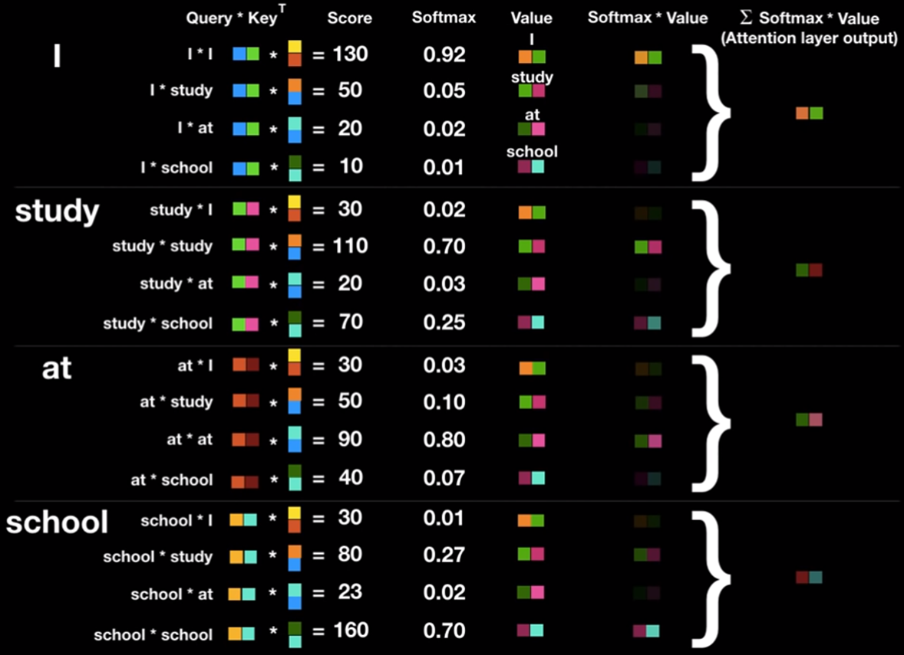

## 시작하며
이번 포스팅에선 트랜스포머의 인코더 구조와 셀프 어텐션과 멀티 헤드 어텐션에 대해 자세히 알아보도록 한다. 트랜스포머의 전체적인 틀과 어텐션에 대해 알고 있다는 가정하에 작성되는 글이기 때문에, 이에 익숙하지 않다면 아래의 링크에서 먼저 공부를 하고 오는 것을 추천한다.
> [어텐션 메커니즘 공부하러 가기](https://parkm2ngyu00.github.io/nlp/attention/)   
> [트랜스포머 기초 개념 공부하러 가기](https://parkm2ngyu00.github.io/nlp/transformer/)   

## 인코더(Encoder)
트랜스포머의 인코더의 구조에 대해 알아보자.   

   

트랜스포머는 하이퍼파라미터인 $\text{num_layers}$개수의 인코더 층을 쌓는다. 논문에서는 총 6개의 인코더 층을 사용하였다. 인코더를 하나의 층이라는 개념으로 생각한다면, 하나의 인코더 층은 크게 총 2개의 서브층(sublayer)으로 나뉘어진다. 셀프 어텐션과 피드 포워드 신경망이다. 위의 그림에서는 멀티 헤드 셀프 어텐션과 포지션 와이즈 피드 포워드 신경망이라고 적혀있지만, 멀티 헤드 셀프 어텐션은 셀프 어텐션을 병렬적으로 사용하였다는 의미고, 포지션 와이즈 피드 포워드 신경망은 우리가 알고있는 일반적인 피드 포워드 신경망이다. 우선 셀프 어텐션에 대해서 알아보자.   

## 인코더의 셀프 어텐션
트랜스포머에서는 셀프 어텐션이라는 어텐션 기법이 등장하는데 앞서 배웠던 어텐션 함수에 대해서 복습하고, 셀프 어텐션이 앞서 배웠던 어텐션과 무엇이 다른지 이해해보자.   

### 1) 셀프 어텐션의 의미와 이점
***
어텐션 함수는 주어진 '쿼리(Query)'에 대해서 모든 '키(Key)'와의 유사도를 각각 구한다. 그리고 구해낸 이 유사도를 가중치로 하여 키와 맵핑되어있는 각각의 '값(Value)'에 반영해준다. 그리고 유사도가 반영된 '값(Value)'을 모두 가중합하여 리턴한다.   

   

여기까지는 앞서 배운 어텐션의 개념이다. 그런데 어텐션 중에서는 셀프 어텐션(self-attention)이라는 것이 있다. 어텐션을 자기 자신에게 수행한다는 의미이다. 앞서 배운 seq2seq에서 어텐션을 사용할 경우의 Q, K, V의 정의를 다시 생각해보자.
```
Q = Query : t 시점의 디코더 셀에서의 은닉 상태
K = Keys : 모든 시점의 인코더 셀의 은닉 상태들
V = Values : 모든 시점의 인코더 셀의 은닉 상태들
```
사실 t 시점이라는 것은 계속 변화하면서 반복적으로 쿼리를 수행하므로 결국 전체 시점에 대해서 일반화를 할 수도 있다.
```
Q = Querys : 모든 시점의 디코더 셀에서의 은닉 상태들
K = Keys : 모든 시점의 인코더 셀의 은닉 상태들
V = Values : 모든 시점의 인코더 셀의 은닉 상태들
```
이처럼 기존에는 디코더 셀의 은닉 상태가 Q이고 인코더 셀의 은닉 상태가 K라는 점에서 Q와 K가 서로 다른 값을 가지고 있었다. 그런데 셀프 어텐션에서는 Q, K, V가 전부 동일하다. 트랜스포머의 셀프 어텐션에서의 Q, K, V는 아래와 같다.
```
Q : 입력 문장의 모든 단어 벡터들
K : 입력 문장의 모든 단어 벡터들
V : 입력 문장의 모든 단어 벡터들
```
셀프 어텐션에 대한 구체적인 사항을 배우기 전에 셀프 어텐션을 통해 얻을 수 있는 대표적인 효과에 대해서 이해해보자.   

   

위의 그림은 트랜스포머에 대한 구글 AI 블로그 포스트에서 가져왔다. 위의 예시 문장을 번역하면 '그 동물은 길을 건너지 않았다. 왜냐하면 그것은 너무 피곤하였기 때문이다.' 라는 의미가 된다. 그런데 여기서 그것(it)에 해당하는 것은 과연 길(street)일까? 동물(animal)일까? 우리는 피곤한 주체가 동물이라는 것을 아주 쉽게 알 수 있지만 기계는 그렇지 않다. 하지만 셀프 어텐션은 입력 문장 내의 단어들끼리 유사도를 구하므로서 그것(it)이 동물(animal)과 연관되었을 확률이 높다는 것을 찾아낸다.   

이제 트랜스포머에서의 셀프 어텐션의 동작 메커니즘을 알아보자.   

### 2) Q, K, V 벡터 얻기
***
앞서 셀프 어텐션은 입력 문장의 단어 벡터들을 가지고 수행한다고 하였는데, 사실 셀프 어텐션은 인코더의 초기 입력인 $d_{model}$의 차원을 가지는 단어 벡터들을 사용하여 셀프 어텐션을 수행하는 것이 아니라 우선 각 단어 벡터들로부터 Q벡터, K벡터, V벡터를 얻는 작업을 거친다. 이때 이 Q벡터, K벡터, V벡터들은 초기 입력인 $d_{model}$의 차원을 가지는 단어 벡터들보다 더 작은 차원을 가지는데, 논문에서는 $d_{model}$=512의 차원을 가졌던 각 단어 벡터들을 64의 차원을 가지는 Q벡터, K벡터, V벡터로 변환하였다.   

64라는 값은 트랜스포머의 또 다른 하이퍼파라미터인 $\text{num_heads}$
로 인해 결정되는데, 트랜스포머는 $d_{model}$을 $\text{num_heads}$로 나눈 값을 각 Q벡터, K벡터, V벡터의 차원으로 결정한다. 논문에서는 $\text{num_heads}$를 8로하였다. 아래의 그림을 통해 이해해보자. 예를 들어 여기서 사용하고 있는 예문 중 student라는 단어 벡터를 Q, K, V의 벡터로 변환하는 과정을 보자.   

   

기존의 벡터로부터 더 작은 벡터는 가중치 행렬을 곱하므로서 완성된다. 각 가중치 행렬은 $d_{model} × (d_{model}\text{/num_heads})$의 크기를 가진다. 이 가중치 행렬은 훈련 과정에서 학습된다. 즉, 논문과 같이 $d_{model}$=512이고 $\text{num_heads}$=8라면, 각 벡터에 3개의 서로 다른 가중치 행렬을 곱하고 64의 크기를 가지는 Q, K, V 벡터를 얻어낸다. 위의 그림은 단어 벡터 중 student 벡터로부터 Q, K, V 벡터를 얻어내는 모습을 보여준다. 모든 단어 벡터에 위와 같은 과정을 거치면 I, am, a, student는 각각의 Q, K, V 벡터를 얻는다.   

### 3) 스케일드 닷-프로덕트 어텐션(Scaled dot-product Attention)
***
Q, K, V 벡터를 얻었다면 지금부터는 기존에 배운 어텐션 메커니즘과 동일하다. 각 Q벡터는 모든 K벡터에 대해서 어텐션 스코어를 구하고, 어텐션 분포를 구한 뒤에 이를 사용하여 모든 V벡터를 가중합하여 어텐션 값 또는 컨텍스트 벡터를 구하게 된다. 그리고 이를 모든 Q벡터에 대해서 반복한다.

그런데 앞서 어텐션 챕터에서 어텐션 함수의 종류는 다양하다고 언급한 바 있다. 트랜스포머에서는 어텐션 챕터에 사용했던 내적만을 사용하는 어텐션 함수 $score(q, k)=q⋅k$가 아니라 여기에 특정값으로 나눠준 어텐션 함수인 $score(q, k)=q⋅k/\sqrt{n}$를 사용한다. 이러한 함수를 사용하는 어텐션을 어텐션 챕터에서 배운 닷-프로덕트 어텐션(dot-product attention)에서 값을 스케일링하는 것을 추가하였다고 하여 **스케일드 닷-프로덕트 어텐션(Scaled dot-product Attention)**이라고 한다. 그림을 통해 이해해보자.   

   

우선 단어 I에 대한 Q벡터를 기준으로 설명해본다. 지금부터 설명하는 과정은 am에 대한 Q벡터, a에 대한 Q벡터, student에 대한 Q벡터에 대해서도 모두 동일한 과정을 거친다. 위의 그림은 단어 I에 대한 Q벡터가 모든 K벡터에 대해서 어텐션 스코어를 구하는 것을 보여준다. 위의 128과 32는 내가 임의로 가정한 수치로 신경쓰지 않아도 좋다.   

위의 그림에서 어텐션 스코어는 각각 단어 I가 단어 I, am, a, student와 얼마나 연관되어 있는지를 보여주는 수치이다. 트랜스포머에서는 두 벡터의 내적값을 스케일링하는 값으로 K벡터의 차원을 나타내는 $d_k$에 루트를 씌운 $\sqrt{d_{k}}$사용하는 것을 택했다. 앞서 언급하였듯이 논문에서 $d_k$는 $d_{model}\text{/num_heads}$라는 식에 따라서 64의 값을 가지므로 $d_k$는 8의 값을 가진다.   

   

이제 어텐션 스코어에 소프트맥스 함수를 사용하여 어텐션 분포(Attention Distribution)을 구하고, 각 V벡터와 가중합하여 어텐션 값(Attention Value)을 구한다. 이를 단어 I에 대한 어텐션 값 또는 단어 I에 대한 컨텍스트 벡터(context vector)라고도 할 수 있다. am에 대한 Q벡터, a에 대 Q벡터, student에 대한 Q벡터에 대해서도 모두 동일한 과정을 반복하여 각각에 대한 어텐션 값을 구한다. 아래 그림은 위의 일련의 과정들을 한번에 표현한 그림이다.   

   

그런데 한 가지 의문이 남는다. 굳이 이렇게 각 Q벡터마다 일일히 따로 연산할 필요가 있을까?   

### 4) 행렬 연산으로 일괄 처리하기
***
사실 각 단어에 대한 Q, K, V 벡터를 구하고 스케일드 닷-프로덕트 어텐션을 수행하였던 위의 과정들은 벡터 연산이 아니라 행렬 연산을 사용하면 일괄 계산이 가능하다. 지금까지 벡터 연산으로 설명하였던 이유는 이해를 돕기 위한 과정이고, 실제로는 행렬 연산으로 구현된다. 위의 과정을 벡터가 아닌 행렬 연산으로 이해해봅시다. 우선, 각 단어 벡터마다 일일히 가중치 행렬을 곱하는 것이 아니라 문장 행렬에 가중치 행렬을 곱하여 Q행렬, K행렬, V행렬을 구한다.   

   

행렬 연산을 통해 어텐션 스코어는 어떻게 구할 수 있을까? 여기서 Q행렬을 K행렬을 전치한 행렬과 곱해준다고 해보자. 이렇게 되면 각각의 단어의 Q벡터와 K벡터의 내적이 각 행렬의 원소가 되는 행렬이 결과로 나온다.   

   

다시 말해 위의 그림의 결과 행렬의 값에 전체적으로 $\sqrt{d_{k}}$를 나누어주면 이는 각 행과 열이 어텐션 스코어 값을 가지는 행렬이 된다. 예를 들어 I 행과 student 열의 값은 I의 Q벡터와 student의 K벡터의 어텐션 스코어 값이다. 위 행렬을 어텐션 스코어 행렬이라 하자. 어텐션 스코어 행렬을 구하였다면 남은 것은 어텐션 분포를 구하고, 이를 사용하여 모든 단어에 대한 어텐션 값을 구하는 일이다. 이는 간단하게 어텐션 스코어 행렬에 소프트맥스 함수를 사용하고, V행렬을 곱하는 것으로 해결된다. 이렇게 되면 각 단어의 어텐션 값을 모두 가지는 어텐션 값 행렬이 결과로 나온다.   

   

위의 그림은 행렬 연산을 통해 모든 값이 일괄 계산되는 과정을 식으로 보여준다. 해당 식은 실제 트랜스포머 논문에 기재된 아래의 수식과 정확하게 일치하는 식이다.   

$$Attention(Q, K, V) = softmax({QK^T\over{\sqrt{d_k}}})V$$   

위의 행렬 연산에 사용된 행렬의 크기를 모두 정리해보자. 우선 입력 문장의 길이를 seq_len이라고 해보자. 그렇다면 문장 행렬의 크기는 $(\text{seq_len},\ d_{model})$이다. 여기에 3개의 가중치 행렬을 곱해서 Q, K, V 행렬을 만들어야 한다.   

결과적으로 $softmax({QK^T\over{\sqrt{d_k}}})V$식을 적용하여 나오는 어텐션 값 행렬 $a$의 크기는 $(\text{seq_len},\ d_{v})$이 된다.   

### 5) 멀티 헤드 어텐션(Multi-head Attention)
***
앞서 배운 어텐션에서는 $d+{model}$의 차원을 가진 단어 벡터를 $\text{num_heads}$로 나눈 차원을 가지는 Q, K, V벡터로 바꾸고 어텐션을 수행하였다. 논문 기준으로는 512의 차원의 각 단어 벡터를 8로 나누어 64차원의 Q, K, V 벡터로 바꾸어서 어텐션을 수행한 셈인데, 이제 $\text{num_heads}$의 의미와 왜 $d+{model}$의 차원을 가진 단어 벡터를 가지고 어텐션을 하지 않고 차원을 축소시킨 벡터로 어텐션을 수행하였는지 이해해보자.   

   

트랜스포머 연구진은 한 번의 어텐션을 하는 것보다 여러번의 어텐션을 병렬로 사용하는 것이 더 효과적이라고 판단하였다. 그래서 $d_{model}$의 차원을 $\text{num_heads}$개로 나누어 $d_{model}\text{/num_heads}$의 차원을 가지는 Q, K, V에 대해서 $\text{num_heads}$개의 병렬 어텐션을 수행한다. 논문에서는 하이퍼파라미터인 $\text{num_heads}$의 값을 8로 지정하였고, 8개의 병렬 어텐션이 이루어지게 된다. 다시 말해 위에서 설명한 어텐션이 8개로 병렬로 이루어지게 되는데, 이때 각각의 어텐션 값 행렬을 어텐션 헤드라고 부른다. 이때 가중치 행렬 $W^{Q}, W^{K}, W^{V}$의 값은 8개의 어텐션 헤드마다 전부 다르다.   

병렬 어텐션으로 얻을 수 있는 효과는 무엇일까? 그리스로마신화에는 머리가 여러 개인 괴물 히드라나 케로베로스가 나온다. 이 괴물들의 특징은 머리가 여러 개이기 때문에 여러 시점에서 상대방을 볼 수 있다는 것이다. 이렇게 되면 시각에서 놓치는 게 별로 없을테니까 이런 괴물들에게 기습을 하는 것이 굉장히 힘이 들것이다. 멀티 헤드 어텐션도 똑같다. 어텐션을 병렬로 수행하여 다른 시각으로 정보들을 수집하겠다는 것이다.   

예를 들어보자. 앞서 사용한 예문 '그 동물은 길을 건너지 않았다. 왜냐하면 그것은 너무 피곤하였기 때문이다.'를 상기해보자. 단어 그것(it)이 쿼리였다고 해보자. 즉, it에 대한 Q벡터로부터 다른 단어와의 연관도를 구하였을 때 첫번째 어텐션 헤드는 '그것(it)'과 '동물(animal)'의 연관도를 높게 본다면, 두번째 어텐션 헤드는 '그것(it)'과 '피곤하였기 때문이다(tired)'의 연관도를 높게 볼 수 있다. 각 어텐션 헤드는 전부 다른 시각에서 보고있기 때문이다.   

   

병렬 어텐션을 모두 수행하였다면 모든 어텐션 헤드를 연결(concatenate)한다. 모두 연결된 어텐션 헤드 행렬의 크기는 $(\text{seq_len},\ d_{model})$가 된다.   

지금까지 그림에서는 지면상의 한계로 4차원을 $d_{model}$=512로 표현하고, 2차원을 $d_v$=64로 표현해왔기 때문에 위의 그림의 행렬의 크기에 혼동의 있을 수 있으나 8개의 어텐션 헤드의 연결(concatenate) 과정의 이해를 위해 이번 행렬만 예외로 위와 같이 $d_{model}$의 크기를 $d_v$의 8배인 16차원으로 표현하였다. 아래의 그림에서는 다시 $d_{model}$를 4차원으로 표현한다.   

   

어텐션 헤드를 모두 연결한 행렬은 또 다른 가중치 행렬 $W^0$을 곱하게 되는데, 이렇게 나온 결과 행렬이 멀티-헤드 어텐션의 최종 결과물이다. 위의 그림은 어텐션 헤드를 모두 연결한 행렬이 가중치 행렬 $W^0$과 곱해지는 과정을 보여준다. 이때 결과물인 멀티-헤드 어텐션 행렬은 인코더의 입력이었던 문장 행렬의 $(\text{seq_len},\ d_{model})$크기와 동일하다.

다시 말해 인코더의 첫번째 서브층인 멀티-헤드 어텐션 단계를 끝마쳤을 때, 인코더의 입력으로 들어왔던 행렬의 크기가 아직 유지되고 있음을 기억해두자. 첫번째 서브층인 멀티-헤드 어텐션과 두번째 서브층인 포지션 와이즈 피드 포워드 신경망을 지나면서 인코더의 입력으로 들어올 때의 행렬의 크기는 계속 유지되어야 합니다. 트랜스포머는 동일한 구조의 인코더를 쌓은 구조이다. 논문 기준으로는 인코더가 총 6개이다. 인코더에서의 입력의 크기가 출력에서도 동일 크기로 계속 유지되어야만 다음 인코더에서도 다시 입력이 될 수 있다.   


## 마지며
트랜스포머 모델의 인코더는 멀티 헤드 셀프 어텐션과 피드 포워드 신경망 두 개의 서브층으로 나뉘어져 있는데, 이번 포스팅에선 멀티 헤드 셀프 어텐션에 대해 자세히 알아보았다. 멀티 헤드 어텐션은 결국 셀프 어텐션을 병렬적으로 사용하여 여러 시각에서 볼 수 있도록 하여 성능을 높인다는 것이다. 다음 장에서는 인코더의 나머지 부분인 피드 포워드 신경망과 잔차 연결, 층 정규화에 대해 알아보도록 하겠다.


## 참고 서적
[딥 러닝을 이용한 자연어 처리 입문](https://wikidocs.net/book/2155) 